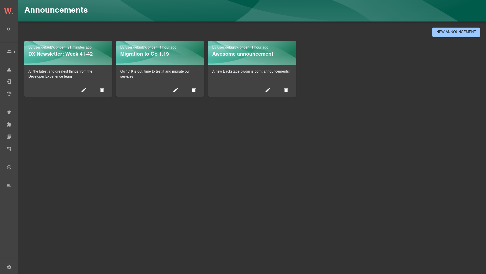

# Announcements plugin for Backstage

The Announcements plugin is a frontend, backend, and common plugin that manages and displays announcements within Backstage.

This plugin provides:

* a component to display the latest announcement as a banner, if there is one
* a component to display the latest announcements, for example on a homepage
* pages to list, view, create, edit and delete announcements
* integration with the [`@backstage/plugin-search`](https://github.com/backstage/backstage/tree/master/plugins/search) plugin

## Setup

Find [installation instructions](./docs/index.md#installation) in our documentation.

## How does it look?

Latest announcement banner:

Announcements card:

Announcements page:

Announcements search:

## License

This library is under the [MIT](LICENSE) license.
